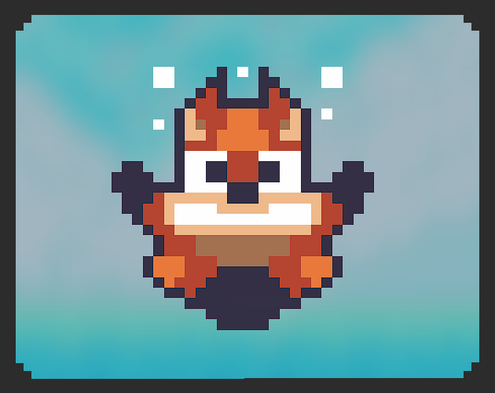
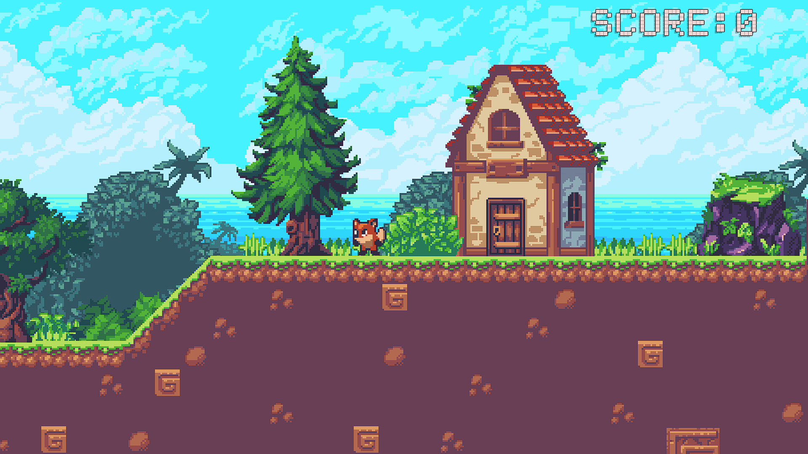
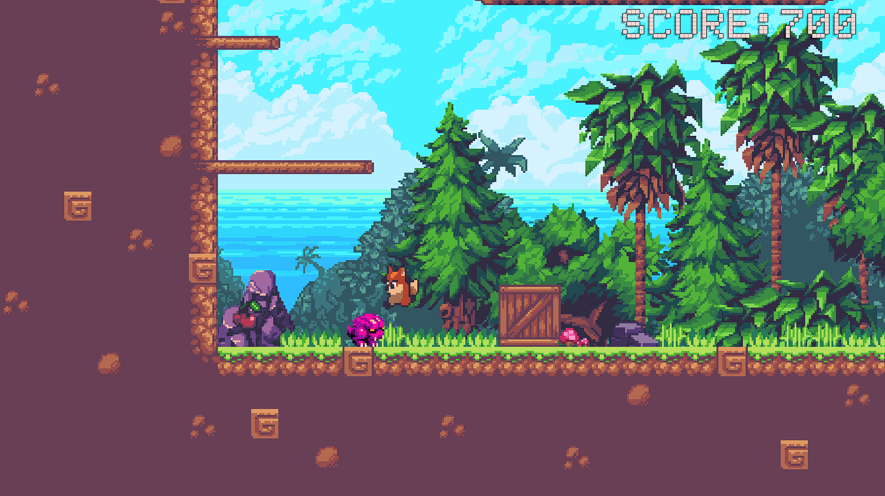
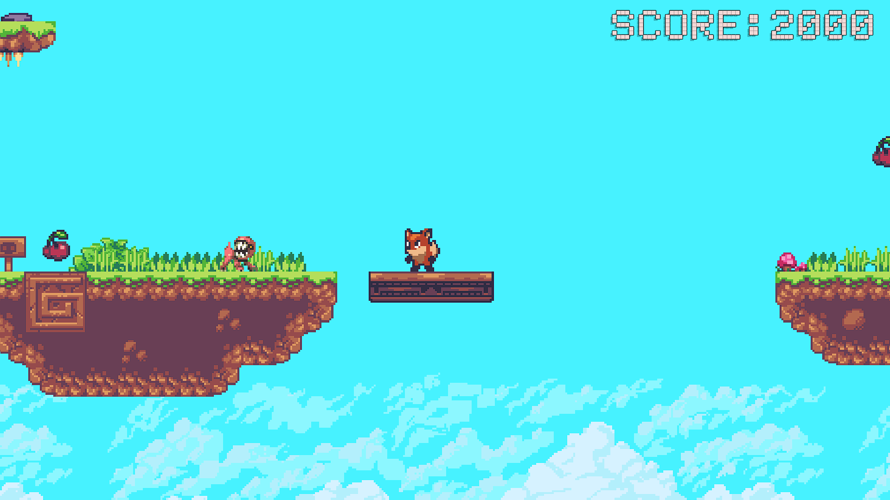
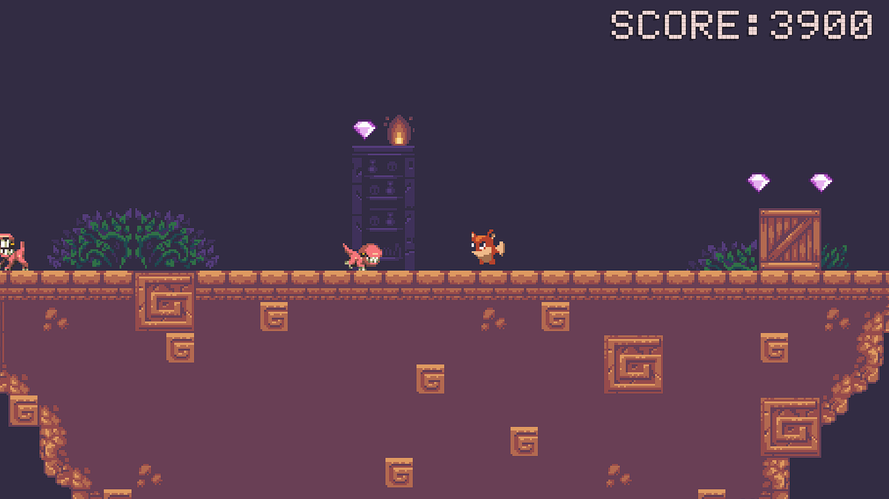

 
<h3 >&emsp;&emsp;Sunny Land Plus</h3>
 
&emsp; A 2D pixel art style platformer game made in Unity. 
The player controls a fox who collects gems and cherries, fights enemies, 
and travels through levels to reunite with his girlfriend.
  
Play the game <a href="https://vexneth.itch.io/sunny-land-plus" >on my Itch.io!</a> 
 
   

## Project Highlights:
  - 2D Platformer game
  - Enemy animations and sounds
  - Moving platforms and movement controllers using raycasts
  - Uses jump buffer and coyote time
  - Collectables with score management system
  - Custom save system using XOR encryption
  - Pause menu with animations
  
  

## In this project, I learned about:
  - How to make player move with moving platforms.
  - Clean code principles, keeping functions focused on a single responsibility.
  - How to use `IEnumerator` and Coroutines.
  - The difference between `Time.deltaTime` and `Time.fixedDeltaTime`.
  - How to make a custom save system.
  - How to manage multiple scenes while using a save system.
  
  

## Technologies & Tools:
  - Unity
  - Aseprite
  - C#
  - GitHub Desktop
  
  

## Screenshots:
 

  
 

## Notes:
This project was made as a learning project to practice Unity 2D basics.
Assets by 
<a href="https://ansimuz.itch.io/sunny-land-pixel-game-art">ansimuz</a>. 
All code was written by me.
  
  
